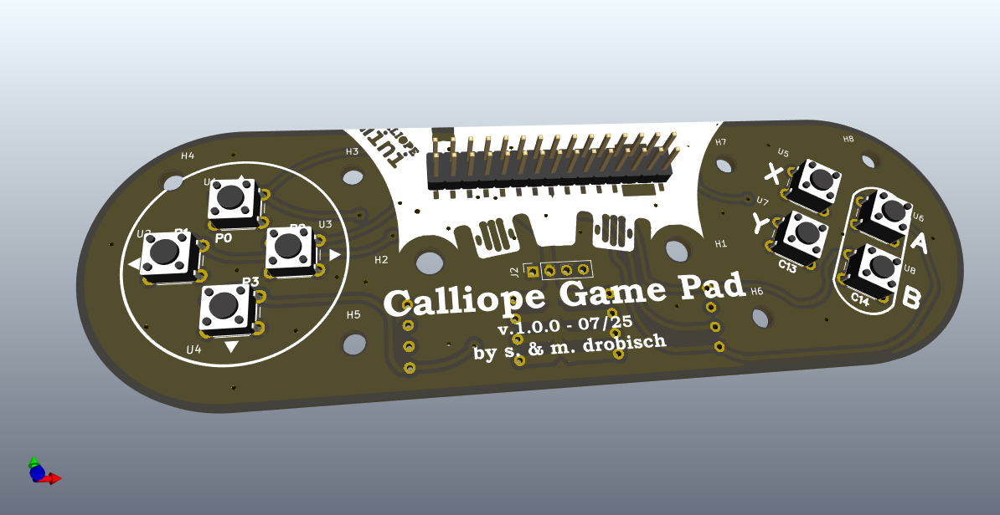

# CalliopeGamePad

The CalliopeGamePad adds a gamepad to the Calliope Mini V3 (https://calliope.cc/).
This project is a open source hardware project made with KiCAD (https://www.kicad.org/).
It is intended to be 100% compatible with the CallioGamer of M. Klein @ https://www.hackster.io/MKlein/calliogamer-f57906 . Thanks goes to M. Klein for his wonderful project and his software @ https://github.com/MKleinSB/pxt-calliogamer.

ATTENTION: Due to the connector the Calliope Game Pad Works **only** with Calliope Mini V3.

Here are some differeneces compared to the CallioGamer:

* The CallioGamer production files seems to be broken somehow (at least for my PCB fab of choice). Now you have the freedom to adjust for yours as well.
* Added some additional mounting holes. So you can add a solid body to the board (e.g., cardboard or 3d-print)
* Optional Pull-Up resistors are available. This can also be used for filtering of the buttons with additional capacitors. There is **no need** to solder this for a working gamepad.
* CalliopeGamePad is made in KiCAD 9 (instead of EasyEDA)

You can remix the project and adjust as you like. The hardware is licensed under Creative Commons (CC BY-SA). Please visit the projects of M.Klein and have fun.

## Build your own

Almost all of the big PCB Fabs are able to handle.kicad_pcb files directly. Just upload and let them produce your Calliope Game Pad. In addition you find the gerber fabrication files in the `gerber` directory.

## Software

Please follow the instruction at https://www.hackster.io/MKlein/calliogamer-f57906 . 

You can find the source code of the CallioGamer firmware at https://github.com/MKleinSB/pxt-calliogamer .

## Legal statement

Please read the DISCLAIMER and the LICENSE.
